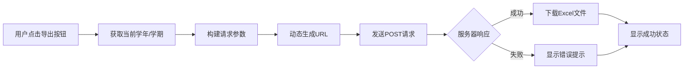

# 方正教务系统成绩分项下载
开箱即用链接：https://greasyfork.org/zh-CN/scripts/524383-%E6%96%B9%E6%AD%A3%E6%95%99%E5%8A%A1%E7%B3%BB%E7%BB%9F%E6%88%90%E7%BB%A9%E5%88%86%E9%A1%B9%E4%B8%8B%E8%BD%BD

这个脚本可以在使用方正教务系统的学校网站中添加一个"导出所有成绩"功能，特别针对成绩查询页面。

### 功能展示
在方正教务系统中找到成绩查询界面
将学年，学期全部改为你要查询的学期，点击查询，此时不会显示成绩
然后直接点击右边“导出所有成绩”按钮
点击后，浏览器会自动下载一个xls文件，里面就是所有的成绩
如需选择导出其他学期成绩重新查询导出即可
如果用不了请邮箱反馈或者添加微信wxuid_ikaikail联系

  

  

  

## 功能概述
这款专为方正教务系统设计的用户脚本，让您能够一键导出包含**详细成绩分项**的Excel文件，帮助您全面了解期末成绩构成，避免被"穿小鞋"的情况发生。

### 核心功能：
- 🔍 **一键导出所有成绩分项**（平时成绩、期末成绩、考勤等）
- 🌐 **智能适配WebVPN环境**，自动处理路径问题
- 📊 **导出完整Excel文件**，包含课程代码、学分、各项成绩等详细信息
- ✅ **操作状态反馈**，实时显示导出成功/失败提示
- 🚀 **无缝集成**，在教务系统界面添加专用导出按钮

## 技术亮点

## 安装与使用

### 安装步骤：
1. 安装Tampermonkey浏览器扩展，确保打开允许运行用户脚本功能
2. 点击https://greasyfork.org/zh-CN/scripts/524383-%E6%96%B9%E6%AD%A3%E6%95%99%E5%8A%A1%E7%B3%BB%E7%BB%9F%E6%88%90%E7%BB%A9%E5%88%86%E9%A1%B9%E4%B8%8B%E8%BD%BD
3. 点击安装此脚本，在新页面点击安装即可
4. 刷新教务系统成绩查询页面

### 使用方法：
1. 登录教务系统，进入成绩查询页面
2. 选择学年和学期
3. 点击新增的 **"导出所有成绩"** 按钮
4. 等待下载完成（系统会自动保存为Excel文件）

## 兼容性说明

| 环境         | 支持情况 | 备注                 |
|--------------|----------|----------------------|
| Chrome浏览器 | ✅ 完美支持 | 推荐使用最新版本     |
| Firefox      | ✅ 支持    | 需安装Tampermonkey   |
| Edge浏览器   | ✅ 支持    | 基于Chromium内核     |
| Safari       | ⚠️ 部分支持 | 需启用用户脚本功能   |
| WebVPN环境   | ✅ 完美支持 | 自动处理路径问题     |

## 使用场景

1. **成绩分析**：了解各分项成绩占比，找出薄弱环节
2. **成绩复核**：核对教师评分是否合理准确
3. **学业规划**：全面了解自己的学习情况，制定提升计划
4. **材料准备**：为奖学金申请、保研等准备成绩证明材料

## 作者声明
> **脚本作者：iKaiKail**  
> 本工具开发旨在帮助学生更好地了解自己的学业情况，请合理合法使用。  
> **未经授权，禁止商用！**  
> 任何商业用途的行为都将被视为侵权行为。

### 为什么需要这个脚本？

1. **解决信息不全问题**：
   - 教务系统前台只显示总分
   - 后台有详细分项成绩（平时成绩、期中、期末等）
   - 脚本通过特定参数请求完整数据

2. **绕过界面限制**：
   - 普通界面不提供分项成绩导出
   - 脚本直接调用系统隐藏的导出接口

3. **标准化操作**：
   - 不同学校使用相同的方正系统
   - 脚本适配多个学校的URL模式

### 工作流程总结

1. **加载与检测**：脚本加载后等待页面关键元素（学年/学期选择框）
2. **添加按钮**：在查询按钮旁添加"导出所有成绩"按钮
3. **用户交互**：用户点击导出按钮
4. **构建请求**：
   - 获取当前学年/学期
   - 构建包含"成绩分项"参数的请求
5. **发送请求**：向教务系统后台发送导出请求
6. **处理响应**：接收Excel文件并触发下载
7. **错误处理**：捕获并显示可能的错误

### 技术亮点

1. **渐进式检测**：使用`setTimeout`轮询确保DOM加载完成
2. **参数精准构造**：通过`URLSearchParams`构建符合服务器要求的参数
3. **跨校兼容**：通过多个`@match`规则适配不同学校
4. **用户体验**：按钮样式与原生界面保持一致
5. **错误处理**：完整的try-catch错误捕获机制

这个脚本本质上是利用了教务系统已有的导出接口，但通过特定参数请求了包含详细分项成绩的数据，这些数据在普通界面中是不可见的，但对学生了解成绩构成非常重要。
